# OpenClaw - Complete System Overview

## Master System Diagram

This is the highest-level view showing how all major subsystems interact.

```mermaid
graph TB
    subgraph "User Layer"
        USERS[Users]
        CLI_USER[CLI Interface]
        MACOS_USER[macOS App]
        IOS_USER[iOS App]
        ANDROID_USER[Android App]
        WEB_USER[Web Interface]
    end
    
    subgraph "Channel Layer"
        TELEGRAM_CH[Telegram]
        DISCORD_CH[Discord]
        SLACK_CH[Slack]
        SIGNAL_CH[Signal]
        IMESSAGE_CH[iMessage]
        WHATSAPP_CH[WhatsApp]
        GCHAT_CH[Google Chat]
        TEAMS_CH[MS Teams]
        EXT_CH[Extension Channels]
    end
    
    subgraph "Gateway Core"
        GATEWAY_CORE[Gateway Server]
        ROUTING[Message Router]
        HOOKS_SYS[Hooks System]
        SECURITY[Security Layer]
        CONFIG_SYS[Configuration]
    end
    
    subgraph "AI & Processing"
        AGENT_SYS[AI Agent Engine]
        PROVIDERS[AI Providers]
        TOOLS[Tool System]
        MEMORY_SYS[Memory System]
        CONTEXT[Context Manager]
    end
    
    subgraph "Media & Content"
        MEDIA_SYS[Media Pipeline]
        CANVAS_SYS[Canvas Host]
        TTS_SYS[Text-to-Speech]
        BROWSER_SYS[Browser Control]
    end
    
    subgraph "Data & Storage"
        SESSIONS[Sessions]
        CREDENTIALS[Credentials]
        CACHE[Cache Layer]
        LOGS[Logging System]
    end
    
    subgraph "Extensions"
        PLUGIN_SDK[Plugin SDK]
        CHANNEL_EXT[Channel Plugins]
        AUTH_EXT[Auth Plugins]
        MEMORY_EXT[Memory Plugins]
        FEATURE_EXT[Feature Plugins]
    end
    
    subgraph "Platform Services"
        PAIRING[Device Pairing]
        DAEMON[Daemon Service]
        NOTIFICATIONS[Notifications]
        VOICE_WAKE[Voice Wake]
    end
    
    %% User connections
    USERS --> CLI_USER
    USERS --> MACOS_USER
    USERS --> IOS_USER
    USERS --> ANDROID_USER
    USERS --> WEB_USER
    
    %% User to Channel
    USERS --> TELEGRAM_CH
    USERS --> DISCORD_CH
    USERS --> SLACK_CH
    USERS --> SIGNAL_CH
    USERS --> WHATSAPP_CH
    
    %% Apps to Gateway
    CLI_USER --> GATEWAY_CORE
    MACOS_USER --> GATEWAY_CORE
    IOS_USER --> GATEWAY_CORE
    ANDROID_USER --> GATEWAY_CORE
    WEB_USER --> GATEWAY_CORE
    
    %% Channels to Gateway
    TELEGRAM_CH --> ROUTING
    DISCORD_CH --> ROUTING
    SLACK_CH --> ROUTING
    SIGNAL_CH --> ROUTING
    IMESSAGE_CH --> ROUTING
    WHATSAPP_CH --> ROUTING
    GCHAT_CH --> ROUTING
    TEAMS_CH --> ROUTING
    EXT_CH --> ROUTING
    
    %% Gateway Core
    GATEWAY_CORE --> ROUTING
    GATEWAY_CORE --> HOOKS_SYS
    GATEWAY_CORE --> SECURITY
    GATEWAY_CORE --> CONFIG_SYS
    
    SECURITY --> ROUTING
    CONFIG_SYS --> GATEWAY_CORE
    
    %% Routing to AI
    ROUTING --> AGENT_SYS
    HOOKS_SYS --> AGENT_SYS
    
    %% AI System
    AGENT_SYS --> PROVIDERS
    AGENT_SYS --> TOOLS
    AGENT_SYS --> MEMORY_SYS
    AGENT_SYS --> CONTEXT
    
    PROVIDERS --> AGENT_SYS
    MEMORY_SYS --> CONTEXT
    
    %% Media Integration
    AGENT_SYS --> MEDIA_SYS
    AGENT_SYS --> CANVAS_SYS
    AGENT_SYS --> TTS_SYS
    TOOLS --> BROWSER_SYS
    
    %% Data Storage
    AGENT_SYS --> SESSIONS
    SECURITY --> CREDENTIALS
    AGENT_SYS --> CACHE
    GATEWAY_CORE --> LOGS
    
    %% Extensions
    PLUGIN_SDK --> CHANNEL_EXT
    PLUGIN_SDK --> AUTH_EXT
    PLUGIN_SDK --> MEMORY_EXT
    PLUGIN_SDK --> FEATURE_EXT
    
    CHANNEL_EXT --> ROUTING
    AUTH_EXT --> PROVIDERS
    MEMORY_EXT --> MEMORY_SYS
    FEATURE_EXT --> AGENT_SYS
    
    %% Platform Services
    GATEWAY_CORE --> PAIRING
    MACOS_USER --> DAEMON
    DAEMON --> GATEWAY_CORE
    GATEWAY_CORE --> NOTIFICATIONS
    MACOS_USER --> VOICE_WAKE
    VOICE_WAKE --> GATEWAY_CORE
    
    %% Styling
    style USERS fill:#e0e0e0
    style GATEWAY_CORE fill:#ff6b6b
    style AGENT_SYS fill:#4ecdc4
    style ROUTING fill:#f38181
    style PLUGIN_SDK fill:#95e1d3
    style SECURITY fill:#ffd93d
    style PROVIDERS fill:#aa96da
```



## System Interaction Patterns

### 1. Message Processing Flow
```
User → Channel → Gateway → Router → Security → Agent → AI Provider → Response
```

### 2. Plugin Integration Flow
```
Extension → Plugin SDK → Gateway Core → Services → Tools/Channels/Memory
```

### 3. Mobile App Flow
```
Mobile App → WebSocket → Gateway → Agent → Streaming Response → Mobile App
```

### 4. Authentication Flow
```
User → OAuth → Provider → Tokens → Credential Storage → API Requests
```

### 5. Media Processing Flow
```
User → Media Upload → Channel → Gateway → Media Pipeline → AI Vision → Response
```

## Key System Principles

### 1. **Single Gateway, Multiple Channels**
- One gateway instance serves all messaging channels
- Unified routing and security model
- Consistent behavior across platforms

### 2. **Provider Agnostic**
- Multiple AI providers supported
- Automatic failover between providers
- Configurable model selection per use case

### 3. **Extensible via Plugins**
- Core functionality in `/src`
- Extensions in `/extensions` workspace packages
- Plugin SDK provides stable API surface

### 4. **Mobile-First Design**
- Native apps for iOS and Android
- macOS menubar integration
- Shared code where possible

### 5. **Security by Default**
- OAuth 2.0 for provider auth
- Platform keychain/keystore for credentials
- Allowlists for channel access
- Device pairing for multi-device

### 6. **Developer Experience**
- TypeScript throughout
- Comprehensive test coverage
- Hot reload and fast builds
- Clear separation of concerns

## Component Responsibilities

### Gateway
- HTTP/WebSocket server
- Message routing
- Security enforcement
- Configuration management
- Daemon lifecycle

### Channels
- Platform-specific messaging adapters
- Webhook/polling handlers
- Message format translation
- Status monitoring

### AI Agent
- Conversation management
- Provider selection and failover
- Tool orchestration
- Context window management
- Streaming response handling

### Extensions
- Channel plugins (additional messaging platforms)
- Auth plugins (custom OAuth flows)
- Memory plugins (vector stores, databases)
- Feature plugins (voice, phone control, etc.)
- Tool plugins (custom AI tools)

### Mobile Apps
- Native UI (SwiftUI/Compose)
- WebSocket communication
- Voice interface
- Canvas rendering
- Offline support

### Infrastructure
- Build system (tsdown, tsup)
- Test framework (Vitest)
- CI/CD (GitHub Actions)
- Documentation (Mintlify)
- Release automation

## Deployment Configurations

### Development
- Local gateway on macOS/Linux/Windows WSL2
- File-based configuration
- Hot reload enabled
- Verbose logging

### Production - Local
- Raspberry Pi or VPS
- systemd/launchd daemon
- Encrypted credentials
- Auto-restart on failure

### Production - Cloud
- Docker container on Fly.io/VPS
- Volume mounts for persistence
- Environment-based config
- Centralized logging

### Mobile
- Gateway runs on local network or cloud
- Apps connect via WebSocket
- Push notifications for offline messages
- Biometric authentication

## Data Flow Patterns

### Configuration
```
Defaults → File → Environment → CLI Args → Runtime
```

### Credentials
```
OAuth → Encrypted Storage → Runtime Decrypt → API Calls
```

### Messages
```
Channel → Gateway → Security → Router → Agent → Provider → Response → Channel
```

### Sessions
```
New Message → Load Context → AI Processing → Store Result → Memory
```

### Media
```
Upload → Pipeline → Decode → Process → Vision AI → Store → Response
```

## Integration Points

### External APIs
- Anthropic Claude API
- OpenAI GPT API
- Telegram Bot API
- Discord API
- Slack API
- Signal API
- And many more via extensions

### Platform Services
- macOS Keychain & Unified Logging
- iOS Keychain & Push Notifications
- Android KeyStore & Firebase
- systemd on Linux
- Docker/containerd

### Development Tools
- pnpm workspace
- TypeScript compiler
- Vitest test runner
- Oxlint/Oxfmt
- GitHub Actions
- Mintlify docs

## Quick Reference

### Source Code
- Core: `src/`
- Apps: `apps/macos`, `apps/ios`, `apps/android`
- Extensions: `extensions/*/`
- Tests: `*.test.ts`, `*.e2e.test.ts`

### Configuration
- Gateway config: `~/.openclaw/config.json`
- Credentials: `~/.openclaw/credentials/`
- Sessions: `~/.openclaw/sessions/`
- Logs: System-specific locations

### Commands
- `openclaw onboard` - Setup wizard
- `openclaw gateway run` - Start gateway
- `openclaw channels status` - Check channels
- `openclaw agent --message "text"` - Send message to AI
- `openclaw config set key value` - Update config

### Key Files
- `package.json` - Dependencies and scripts
- `tsconfig.json` - TypeScript configuration
- `vitest.config.ts` - Test configuration
- `Dockerfile` - Container image
- `fly.toml` - Fly.io deployment

## Related Diagrams

For detailed views of each subsystem, see the numbered diagram files:
- 01: System Architecture
- 02: Repository Structure
- 03: Message Flow
- 04: Development Workflow
- 05: Plugin Architecture
- 06: Data Flow
- 07: Deployment
- 08: AI Provider Integration
- 09: Mobile Architecture
- 10: Security Architecture
