# OpenClaw System Architecture

## High-Level Architecture

```mermaid
graph TB
    subgraph "User Interfaces"
        CLI[CLI Tools]
        MACOS[macOS App]
        IOS[iOS App]
        ANDROID[Android App]
        WEB[Web Interface]
    end
    
    subgraph "Gateway Service"
        GATEWAY[Gateway Server]
        ROUTER[Message Router]
        HOOKS[Hooks System]
        CRON[Cron Scheduler]
    end
    
    subgraph "Channel Integrations"
        TELEGRAM[Telegram]
        DISCORD[Discord]
        SLACK[Slack]
        SIGNAL[Signal]
        IMESSAGE[iMessage]
        WHATSAPP[WhatsApp]
        GCHAT[Google Chat]
        MSTEAMS[MS Teams]
        MORE[...more channels]
    end
    
    subgraph "Extension System"
        PLUGINS[Plugin SDK]
        EXTS[Extensions]
        BLUEBUBBLES[BlueBubbles]
        MATRIX[Matrix]
        ZALO[Zalo]
        VOICE[Voice Call]
    end
    
    subgraph "AI Providers"
        ANTHROPIC[Anthropic Claude]
        OPENAI[OpenAI GPT]
        OLLAMA[Ollama Local]
        TOGETHER[Together.ai]
        FIREWORKS[Fireworks]
    end
    
    subgraph "Core Services"
        AGENT[AI Agent Engine]
        MEDIA[Media Pipeline]
        MEMORY[Memory System]
        CANVAS[Canvas Host]
        TTS[Text-to-Speech]
        BROWSER[Browser Control]
    end
    
    subgraph "Infrastructure"
        CONFIG[Configuration]
        LOGGING[Logging]
        SECURITY[Security Layer]
        PAIRING[Device Pairing]
    end
    
    CLI --> GATEWAY
    MACOS --> GATEWAY
    IOS --> GATEWAY
    ANDROID --> GATEWAY
    WEB --> GATEWAY
    
    GATEWAY --> ROUTER
    GATEWAY --> HOOKS
    GATEWAY --> CRON
    
    ROUTER --> TELEGRAM
    ROUTER --> DISCORD
    ROUTER --> SLACK
    ROUTER --> SIGNAL
    ROUTER --> IMESSAGE
    ROUTER --> WHATSAPP
    ROUTER --> GCHAT
    ROUTER --> MSTEAMS
    ROUTER --> MORE
    
    GATEWAY --> PLUGINS
    PLUGINS --> EXTS
    EXTS --> BLUEBUBBLES
    EXTS --> MATRIX
    EXTS --> ZALO
    EXTS --> VOICE
    
    ROUTER --> AGENT
    AGENT --> ANTHROPIC
    AGENT --> OPENAI
    AGENT --> OLLAMA
    AGENT --> TOGETHER
    AGENT --> FIREWORKS
    
    AGENT --> MEDIA
    AGENT --> MEMORY
    AGENT --> CANVAS
    AGENT --> TTS
    AGENT --> BROWSER
    
    GATEWAY --> CONFIG
    GATEWAY --> LOGGING
    GATEWAY --> SECURITY
    GATEWAY --> PAIRING
    
    style GATEWAY fill:#ff6b6b
    style AGENT fill:#4ecdc4
    style PLUGINS fill:#95e1d3
    style ANTHROPIC fill:#f38181
    style OPENAI fill:#aa96da
```

## Component Descriptions

### Gateway Service
The central control plane that manages all message routing, hooks, scheduling, and coordination between channels and AI providers.

### Channel Integrations
Built-in messaging platform integrations including Telegram, Discord, Slack, Signal, iMessage, WhatsApp, Google Chat, and Microsoft Teams. Each channel has dedicated handlers for sending/receiving messages.

### Extension System
Plugin SDK allows custom channel integrations and functionality extensions. Extensions live in separate workspace packages under `extensions/`.

### AI Providers
Multi-provider support with OAuth and API key authentication. Supports Anthropic Claude, OpenAI GPT, local Ollama models, Together.ai, Fireworks, and more.

### Core Services
- **AI Agent Engine**: Orchestrates conversations, tool usage, and multi-turn interactions
- **Media Pipeline**: Handles images, video, audio processing
- **Memory System**: Persistent memory and context management
- **Canvas Host**: A2UI canvas for interactive visual content
- **Text-to-Speech**: Voice synthesis for audio responses
- **Browser Control**: Web automation and scraping capabilities

### Infrastructure
Configuration management, structured logging, security layer, and device pairing for secure multi-device setup.
