# OpenClaw Repository Structure

## Monorepo Organization

```mermaid
graph LR
    ROOT[openclaw/]
    
    subgraph "Source Code"
        SRC[src/]
        CLI[src/cli/]
        CMDS[src/commands/]
        GATEWAY[src/gateway/]
        CHANNELS[src/channels/]
        PROVIDERS[src/providers/]
        INFRA[src/infra/]
        MEDIA[src/media/]
        AGENTS[src/agents/]
        HOOKS[src/hooks/]
        PLUGINS[src/plugins/]
        UTILS[src/utils/]
    end
    
    subgraph "Applications"
        APPS[apps/]
        MACOS[apps/macos/]
        IOS[apps/ios/]
        ANDROID[apps/android/]
        SHARED[apps/shared/]
    end
    
    subgraph "Extensions"
        EXTS[extensions/]
        DISCORD_EXT[extensions/discord/]
        SIGNAL_EXT[extensions/signal/]
        SLACK_EXT[extensions/slack/]
        TELEGRAM_EXT[extensions/telegram/]
        MATRIX_EXT[extensions/matrix/]
        MSTEAMS_EXT[extensions/msteams/]
        WHATSAPP_EXT[extensions/whatsapp/]
        VOICE_EXT[extensions/voice-call/]
        MORE_EXTS[...more extensions]
    end
    
    subgraph "Documentation"
        DOCS[docs/]
        START[docs/start/]
        INSTALL[docs/install/]
        CHANNELS_DOC[docs/channels/]
        PLATFORMS[docs/platforms/]
        REFERENCE[docs/reference/]
    end
    
    subgraph "Infrastructure"
        SCRIPTS[scripts/]
        TESTS[test/]
        DOCKER[Dockerfile*]
        CI[.github/]
        PATCHES[patches/]
    end
    
    ROOT --> SRC
    ROOT --> APPS
    ROOT --> EXTS
    ROOT --> DOCS
    ROOT --> SCRIPTS
    ROOT --> TESTS
    
    SRC --> CLI
    SRC --> CMDS
    SRC --> GATEWAY
    SRC --> CHANNELS
    SRC --> PROVIDERS
    SRC --> INFRA
    SRC --> MEDIA
    SRC --> AGENTS
    SRC --> HOOKS
    SRC --> PLUGINS
    SRC --> UTILS
    
    APPS --> MACOS
    APPS --> IOS
    APPS --> ANDROID
    APPS --> SHARED
    
    EXTS --> DISCORD_EXT
    EXTS --> SIGNAL_EXT
    EXTS --> SLACK_EXT
    EXTS --> TELEGRAM_EXT
    EXTS --> MATRIX_EXT
    EXTS --> MSTEAMS_EXT
    EXTS --> WHATSAPP_EXT
    EXTS --> VOICE_EXT
    EXTS --> MORE_EXTS
    
    DOCS --> START
    DOCS --> INSTALL
    DOCS --> CHANNELS_DOC
    DOCS --> PLATFORMS
    DOCS --> REFERENCE
    
    style ROOT fill:#f9f9f9
    style SRC fill:#ff6b6b
    style APPS fill:#4ecdc4
    style EXTS fill:#95e1d3
    style DOCS fill:#ffd93d
```

## Directory Structure Details

### `/src` - Core Source Code
- **cli/**: CLI argument parsing, commands orchestration
- **commands/**: Individual CLI command implementations
- **gateway/**: Gateway server, HTTP/WebSocket endpoints
- **channels/**: Core channel integrations (message handlers)
- **providers/**: AI provider integrations and auth
- **infra/**: Infrastructure utilities, Docker, deployment
- **media/**: Media processing pipeline (images, video, audio)
- **agents/**: AI agent logic, conversation management
- **hooks/**: Hook system for extensibility
- **plugins/**: Plugin SDK and plugin loader
- **utils/**: Shared utilities and helpers

### `/apps` - Platform Applications
- **macos/**: macOS menubar app (SwiftUI)
- **ios/**: iOS mobile app (SwiftUI)
- **android/**: Android app (Kotlin)
- **shared/**: Shared code between mobile platforms

### `/extensions` - Plugin Extensions
Each extension is a workspace package with its own `package.json`:
- Channel plugins (Discord, Signal, Slack, Telegram, etc.)
- Authentication plugins (OAuth flows)
- Feature plugins (voice-call, phone-control, memory)
- Runtime dependencies must be in `dependencies`, not `workspace:*`

### `/docs` - Documentation
- Hosted on Mintlify at docs.openclaw.ai
- Supports i18n (zh-CN via generation pipeline)
- Internal links: root-relative without `.md` extension

### `/scripts` - Build & Utility Scripts
- Build automation (TypeScript, Swift, Android)
- Release scripts (packaging, codesigning)
- Documentation generation
- Testing utilities

### `/test` - Test Fixtures & E2E Tests
- Unit tests colocated with source (`*.test.ts`)
- E2E tests in `*.e2e.test.ts`
- Test fixtures and helpers

### Infrastructure Files
- **Dockerfile**: Multi-stage builds for containers
- **docker-compose.yml**: Local development stack
- **.github/**: CI/CD workflows, issue templates
- **patches/**: pnpm patches for dependencies
