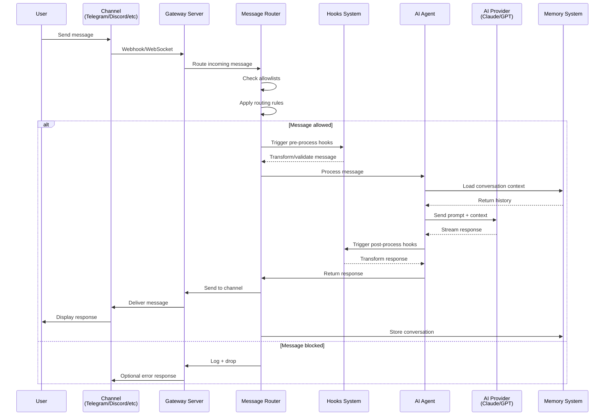
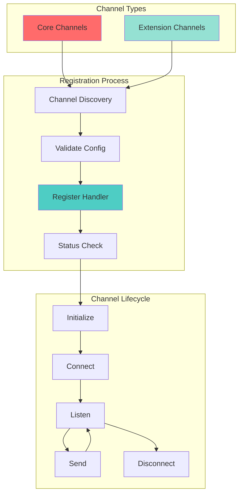
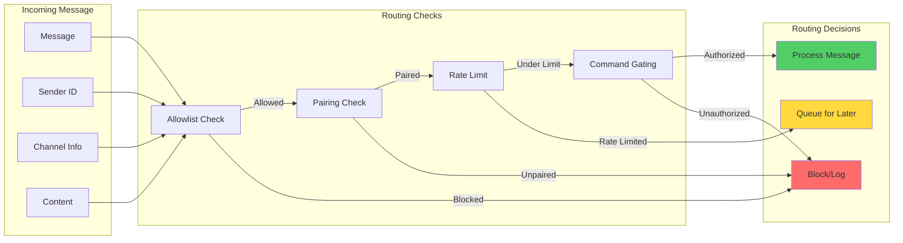

# OpenClaw Message Flow Architecture

## Message Routing Flow

## Channel Registration & Discovery

## Routing Rules & Allowlists

## Multi-Channel Support

All built-in and extension channels follow the same routing architecture:

### Built-in Channels (Core)
- Telegram (`src/telegram`)
- Discord (`src/discord`)
- Slack (`src/slack`)
- Signal (`src/signal`)
- iMessage (`src/imessage`)
- WhatsApp Web (`src/web`)
- Google Chat (via extension)
- Microsoft Teams (via extension)

### Extension Channels
- BlueBubbles (`extensions/bluebubbles`)
- Matrix (`extensions/matrix`)
- Zalo (`extensions/zalo`)
- Zalo Personal (`extensions/zalouser`)
- Feishu (`extensions/feishu`)
- Mattermost (`extensions/mattermost`)
- Nextcloud Talk (`extensions/nextcloud-talk`)
- Voice Call (`extensions/voice-call`)

Each channel implements:
1. **Message Handler**: Receives and parses incoming messages
2. **Sender**: Formats and sends outgoing messages
3. **Status Check**: Health and connectivity validation
4. **Configuration**: Channel-specific settings and credentials
