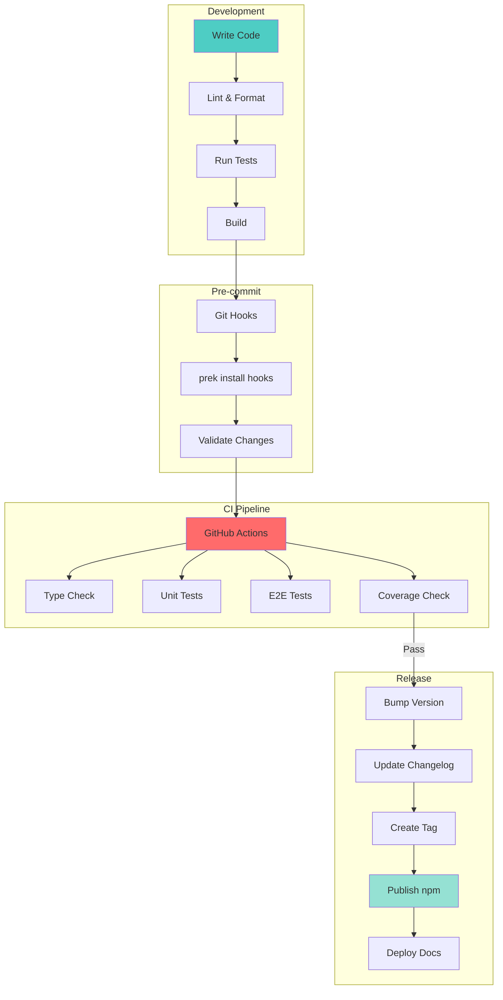
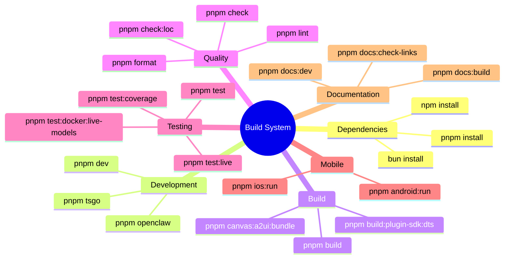
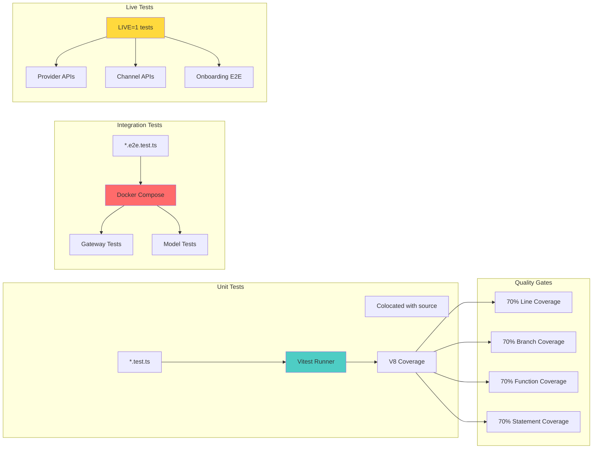
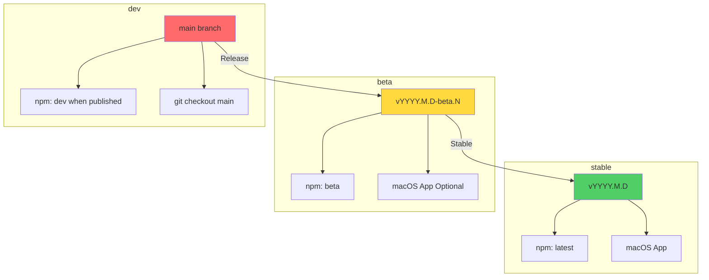
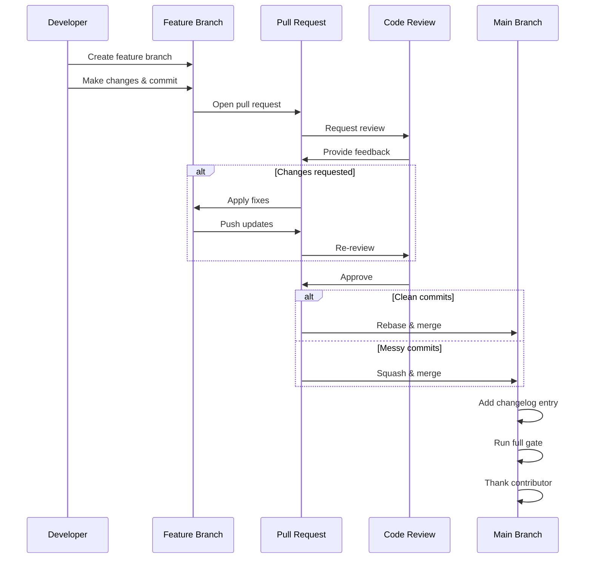

# OpenClaw Development Workflow

## Build & Test Pipeline



## Build Commands



## Testing Strategy



## Release Channels



## Commit Workflow

### Using committer script
```bash
scripts/committer "feat: add new channel" <files>
```

### Conventional Commit Format
- `feat:` - New features
- `fix:` - Bug fixes
- `docs:` - Documentation changes
- `refactor:` - Code refactoring
- `test:` - Test additions/fixes
- `chore:` - Maintenance tasks

### PR Workflow



## Platform-Specific Builds

### macOS App
```bash
scripts/package-mac-app.sh  # Current arch
scripts/codesign-mac-app.sh # Sign & notarize
scripts/create-dmg.sh       # Create installer
```

### Mobile Apps
```bash
# iOS
cd apps/ios && xcodebuild ...

# Android
pnpm android:assemble
pnpm android:install
pnpm android:run
```

### Documentation Site
```bash
pnpm docs:dev   # Local preview
pnpm docs:build # Build & check links
```
