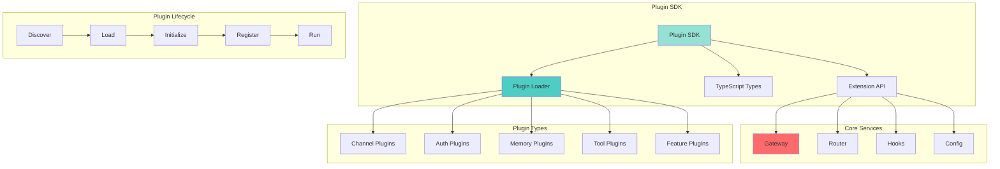
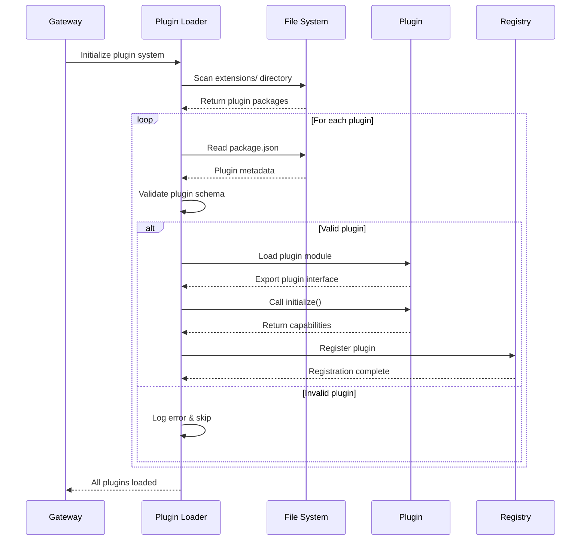
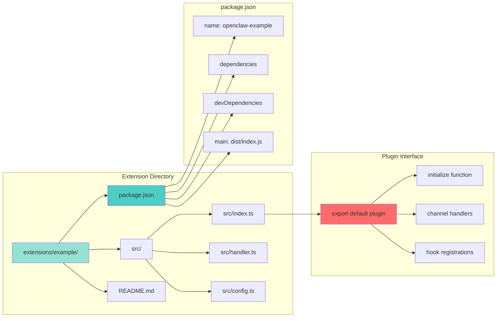
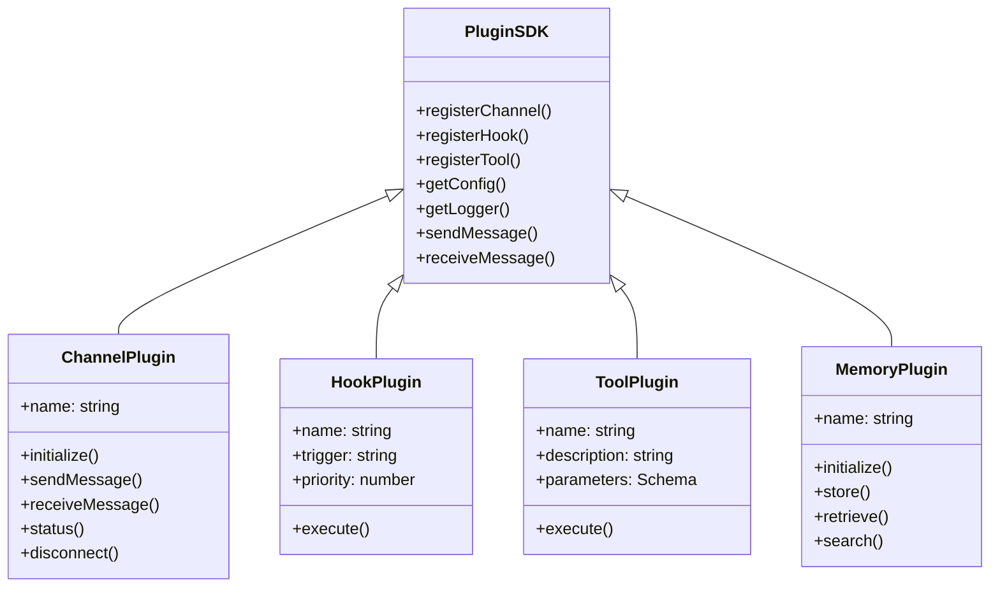
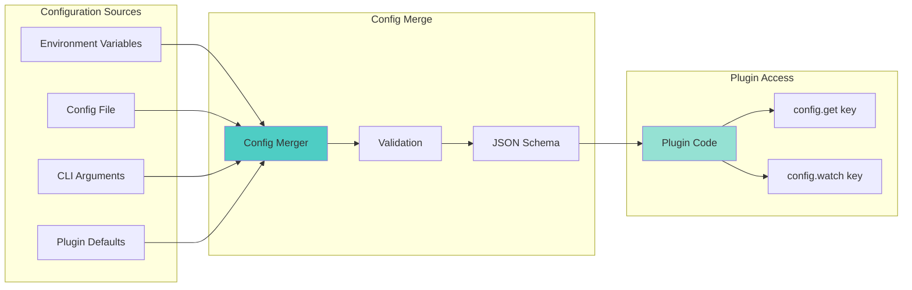
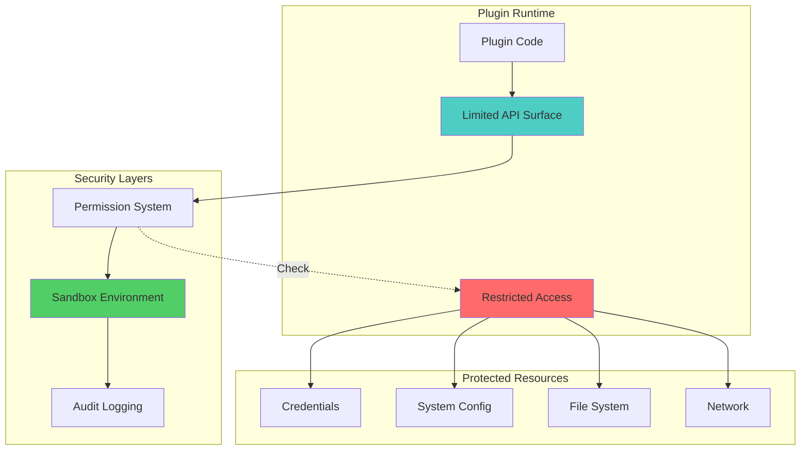

# OpenClaw Plugin Architecture

## Plugin System Overview



## Plugin Discovery & Loading



## Extension Package Structure



## Plugin Types & Use Cases

### Channel Plugins
Add support for new messaging platforms:
- `extensions/discord/` - Discord integration
- `extensions/signal/` - Signal messaging
- `extensions/matrix/` - Matrix protocol
- `extensions/msteams/` - Microsoft Teams
- `extensions/zalo/` - Zalo messenger

### Authentication Plugins
Custom OAuth/Auth flows:
- `extensions/google-antigravity-auth/` - Google AI auth
- `extensions/google-gemini-cli-auth/` - Gemini CLI auth
- `extensions/minimax-portal-auth/` - MiniMax portal
- `extensions/qwen-portal-auth/` - Qwen portal

### Memory Plugins
Custom memory backends:
- `extensions/memory-core/` - Core memory interface
- `extensions/memory-lancedb/` - LanceDB vector store

### Feature Plugins
Extended capabilities:
- `extensions/phone-control/` - Phone automation
- `extensions/voice-call/` - Voice calling
- `extensions/talk-voice/` - Voice synthesis
- `extensions/device-pair/` - Device pairing
- `extensions/diagnostics-otel/` - OpenTelemetry

### Tool Plugins
AI tool integrations:
- `extensions/llm-task/` - LLM task delegation
- `extensions/open-prose/` - Prose generation
- `extensions/lobster/` - Lobster color palette

## Plugin API Surface



## Plugin Configuration



## Plugin Installation & Runtime

### Installation Flow
```bash
# Plugin dependencies installed separately
npm install --omit=dev  # In plugin directory

# Runtime dependencies in 'dependencies'
# Dev dependencies in 'devDependencies'
# Never use 'workspace:*' in dependencies
```

### Runtime Resolution
- Plugins loaded via jiti (just-in-time TypeScript)
- `openclaw/plugin-sdk` resolved via jiti alias
- Core dependencies resolved from parent node_modules
- Plugin dependencies isolated in plugin's node_modules

### Dependency Guidelines
```json
{
  "dependencies": {
    "third-party-lib": "^1.0.0"
  },
  "devDependencies": {
    "openclaw": "workspace:*"
  },
  "peerDependencies": {
    "openclaw": "*"
  }
}
```

## Plugin Security & Isolation


