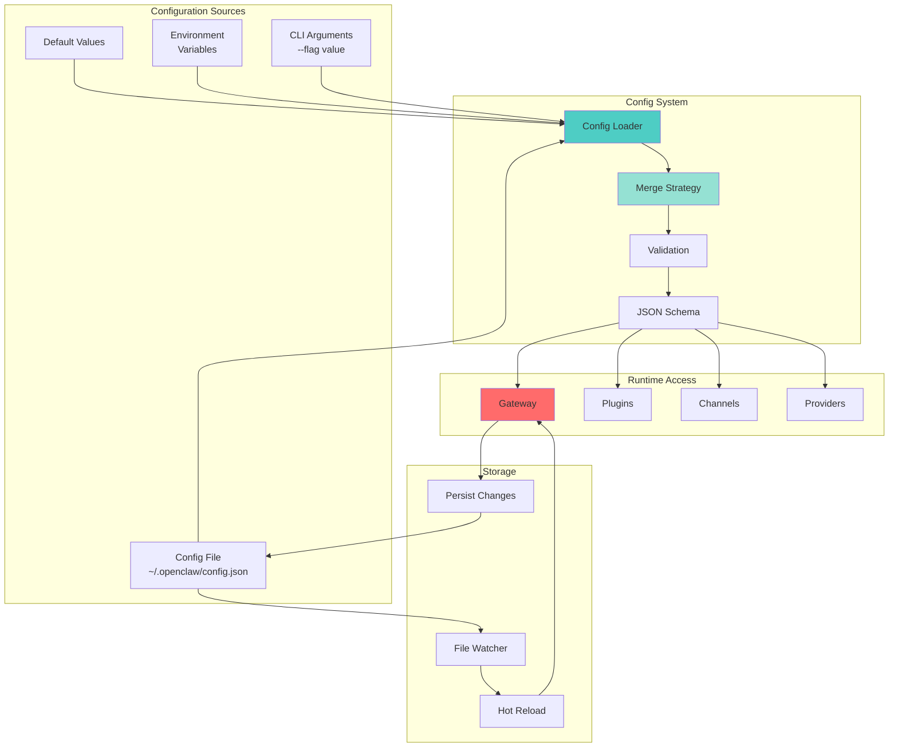
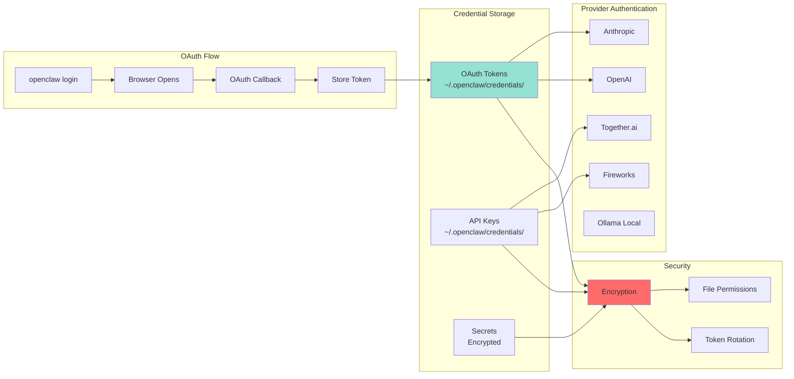
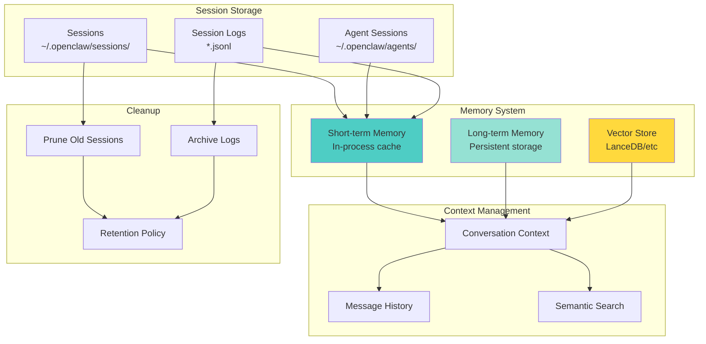
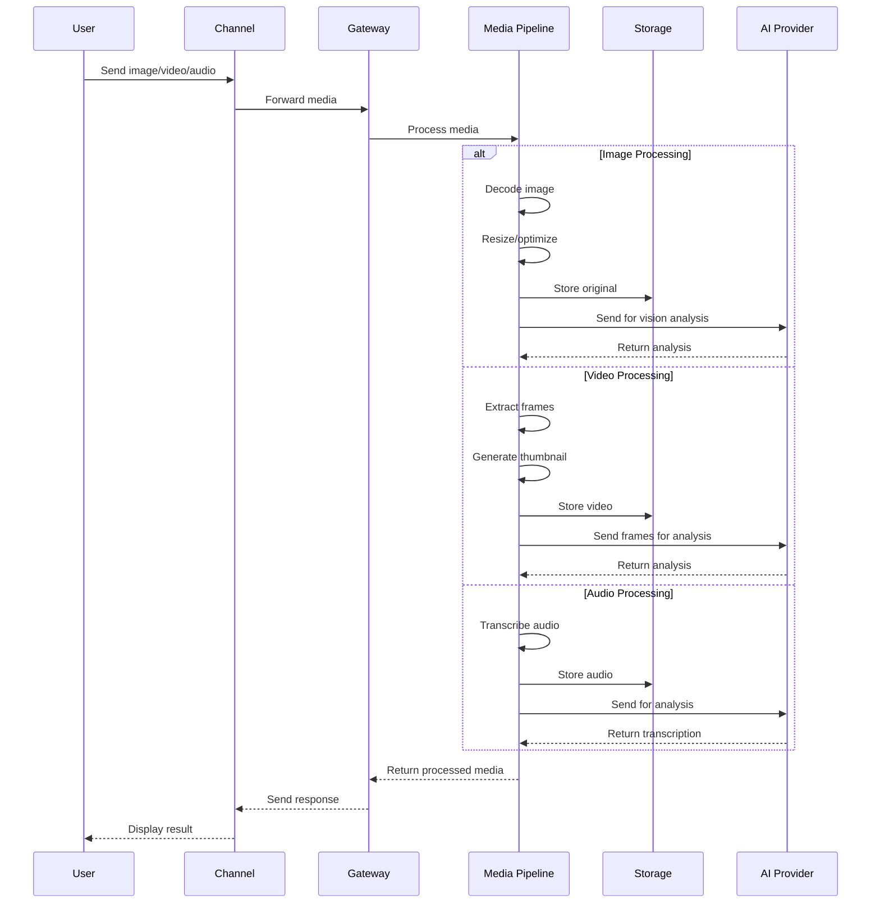
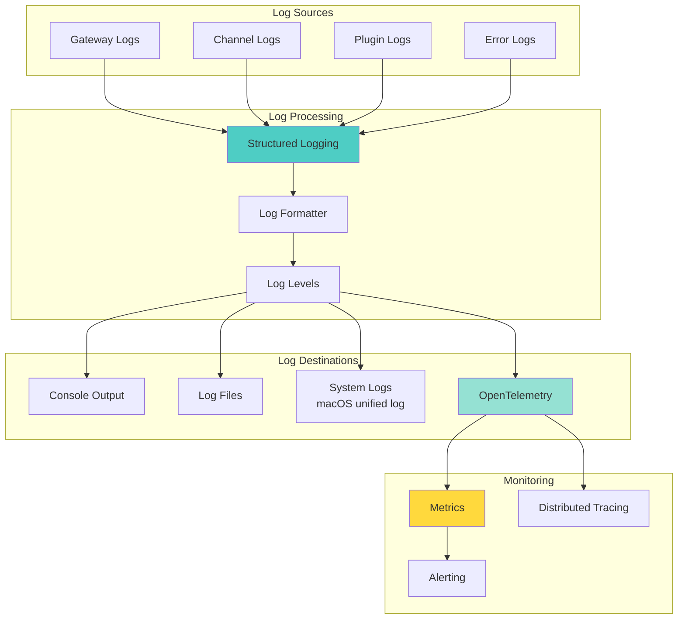
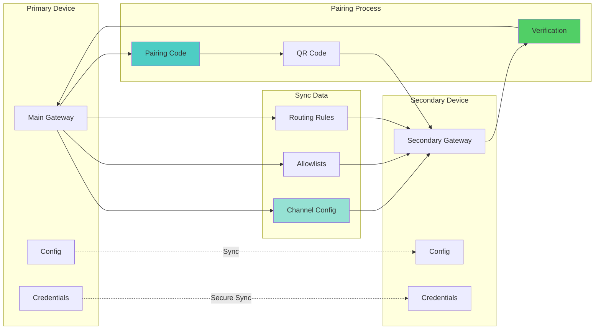
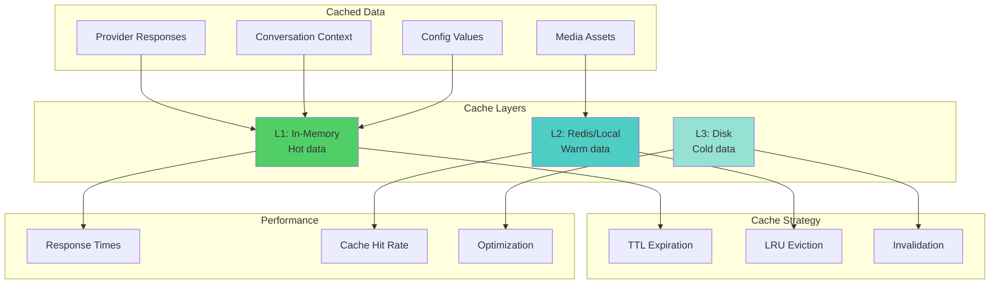

# OpenClaw Data Flow Architecture

## Configuration Data Flow

## Credential Management

## Session & Memory Storage

## Media Pipeline Data Flow

## Logging & Observability

## Pairing & Device Sync

## Cache & Performance

