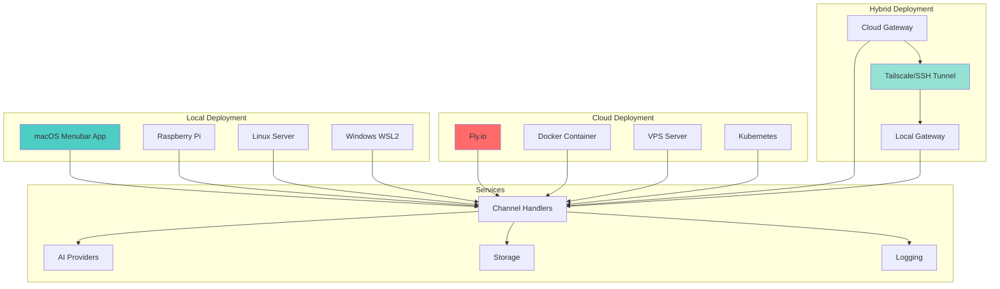
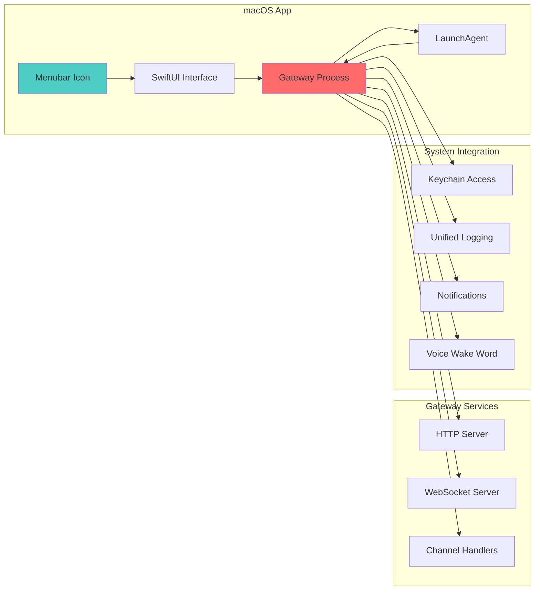
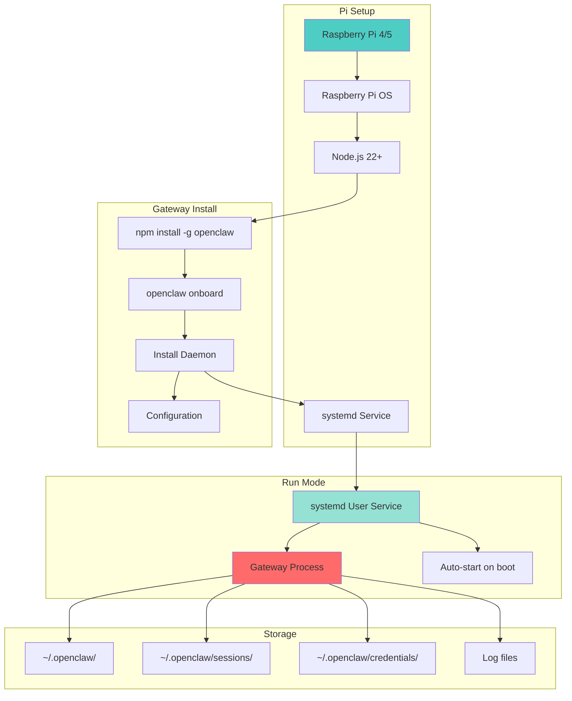
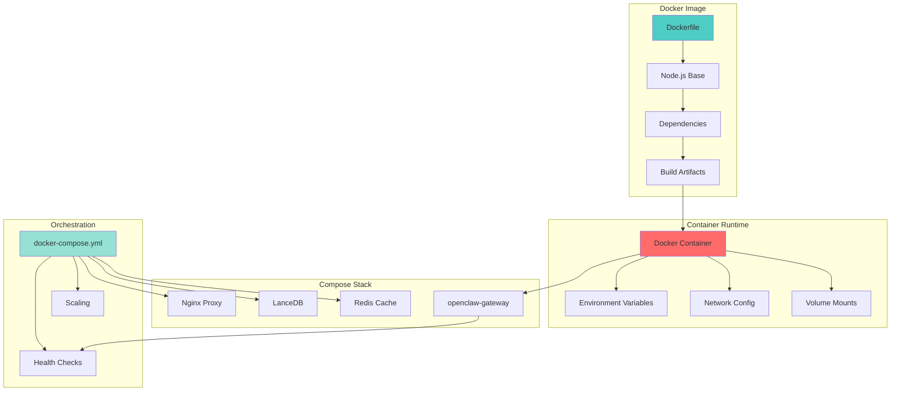
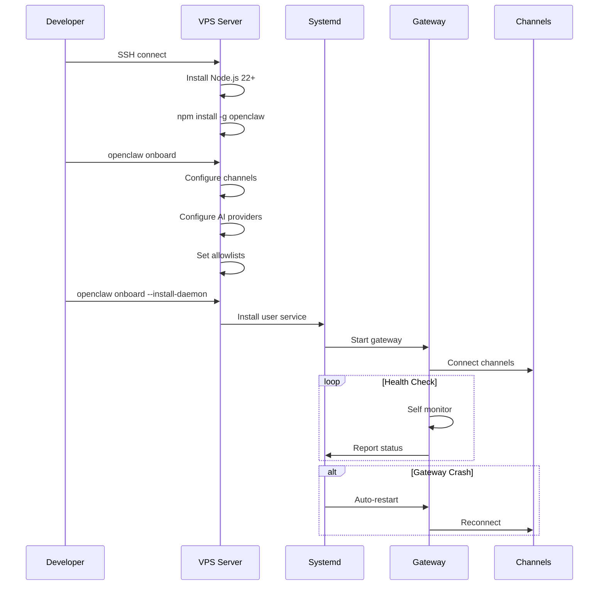
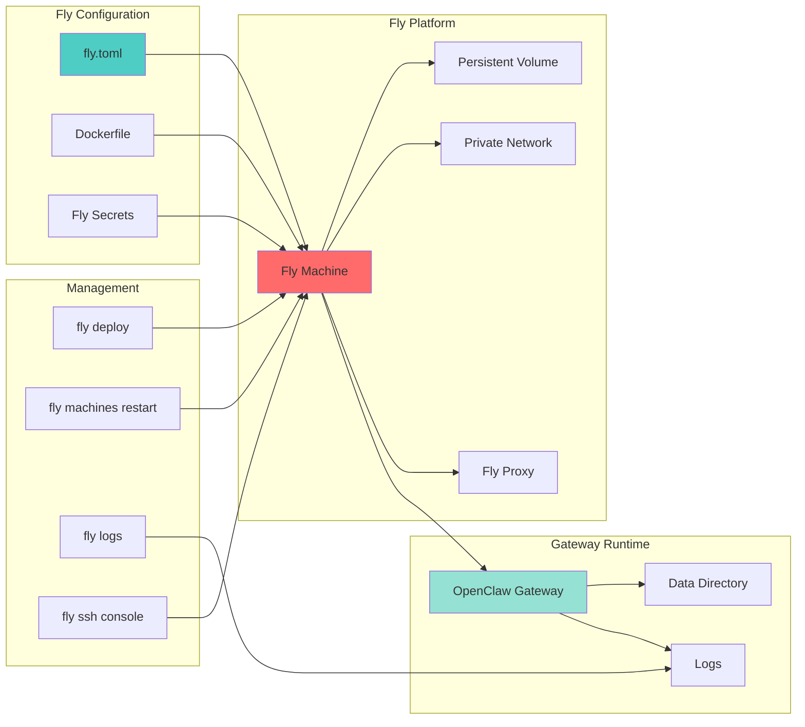
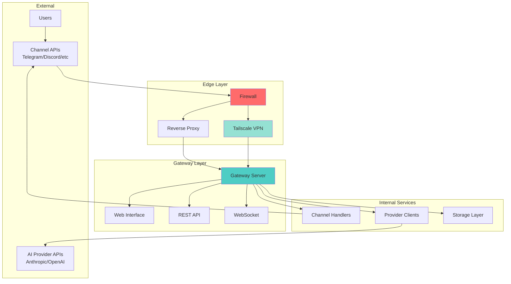
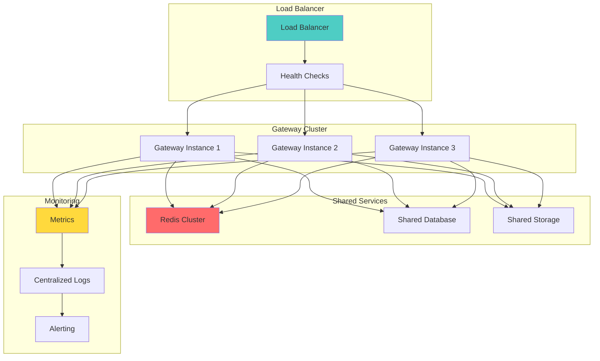

# OpenClaw Deployment Architecture

## Deployment Scenarios

## macOS Deployment

## Raspberry Pi Deployment

## Docker Deployment

## Cloud VPS Deployment

## Fly.io Deployment

## Network Architecture

## High Availability Setup

