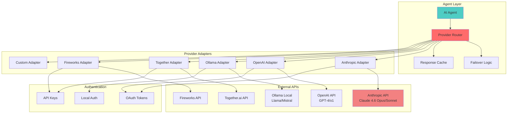
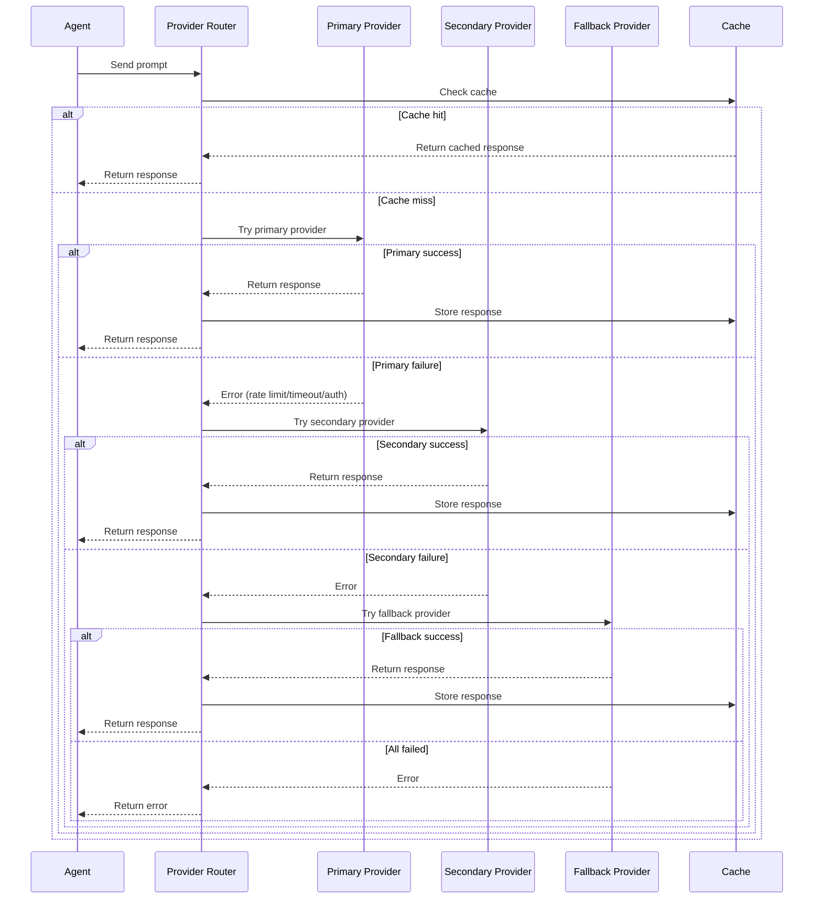
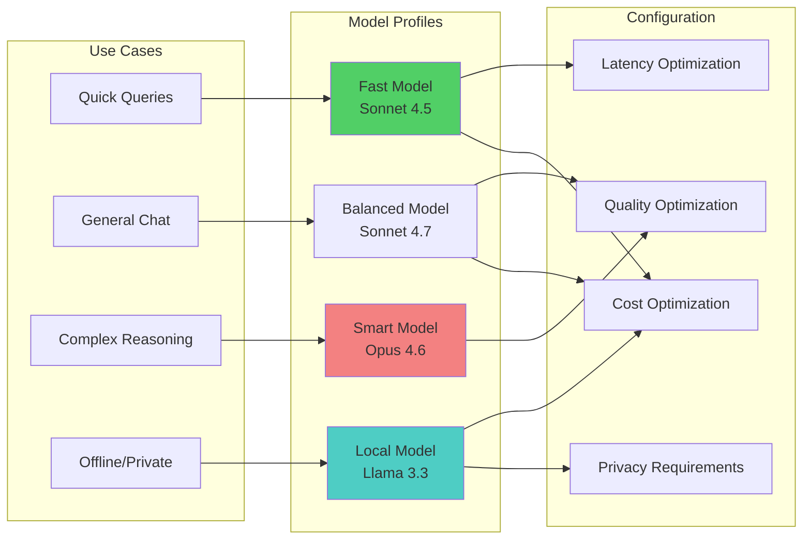
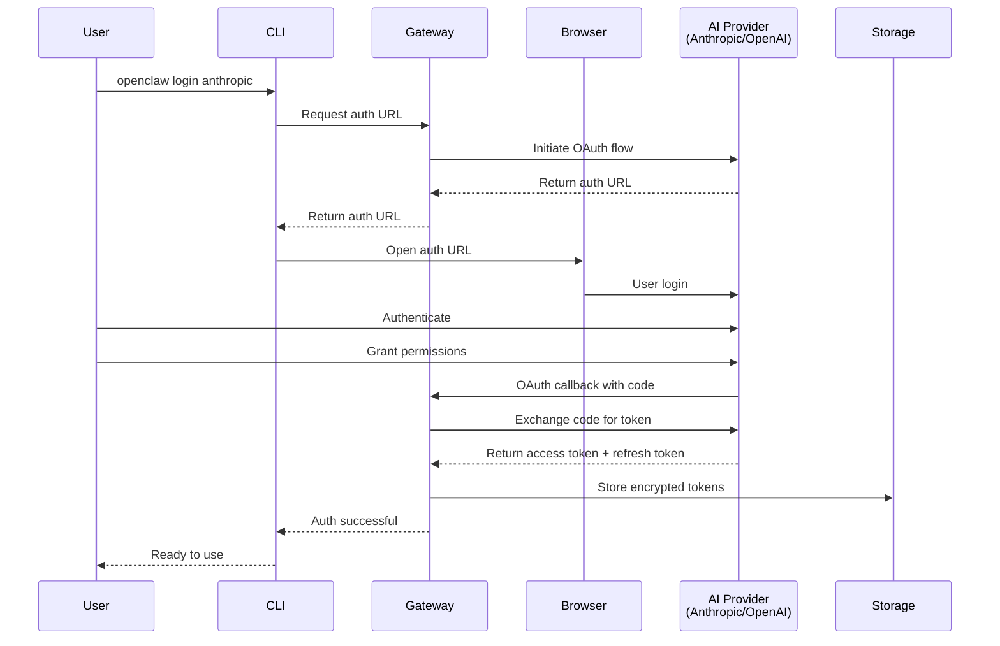
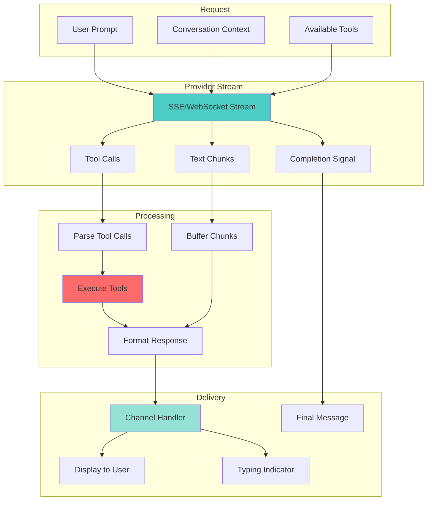
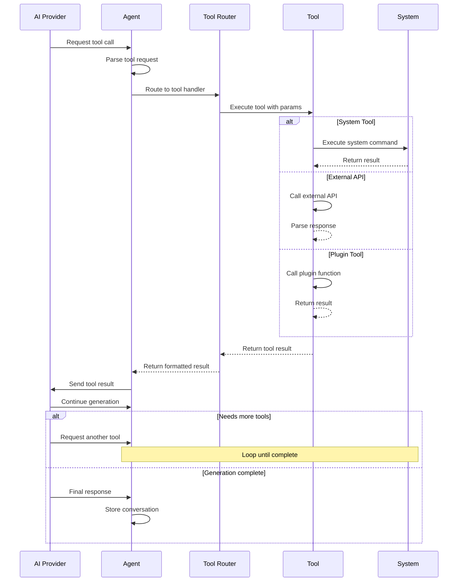
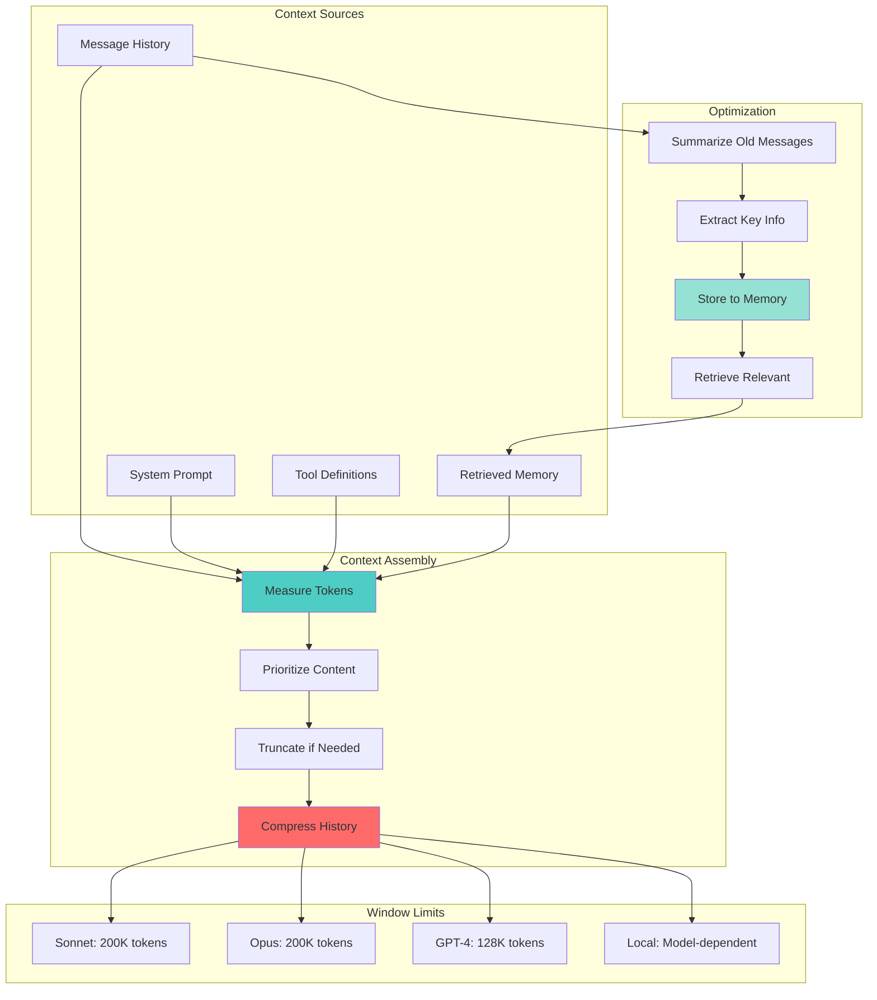
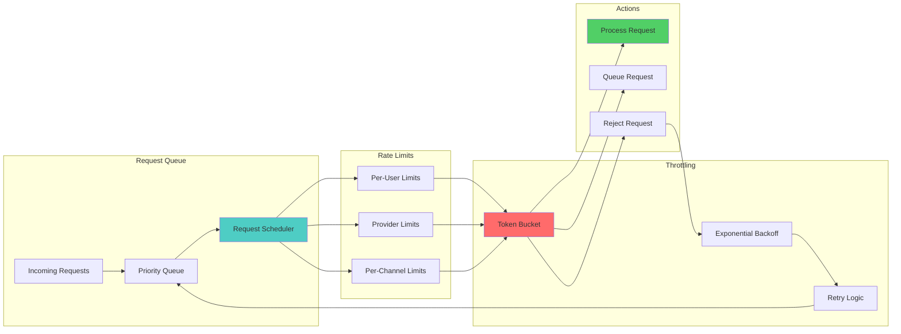

# OpenClaw AI Provider Integration

## Multi-Provider Architecture

## Provider Selection & Failover

## Model Configuration

## OAuth Authentication Flow

## Streaming Response Handling

## Tool Execution Flow

## Context Window Management

## Rate Limiting & Throttling

