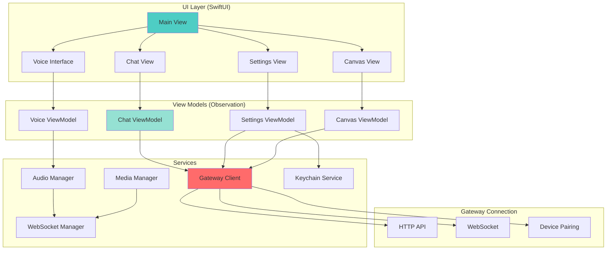
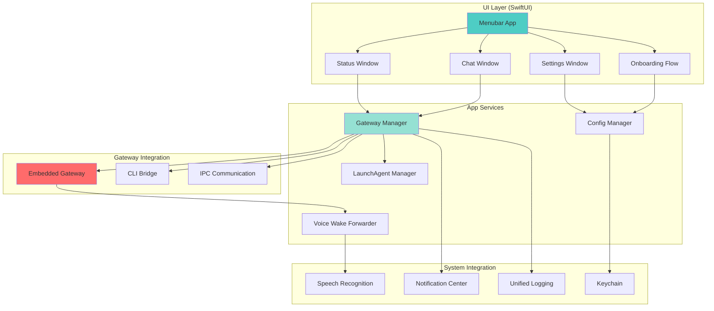
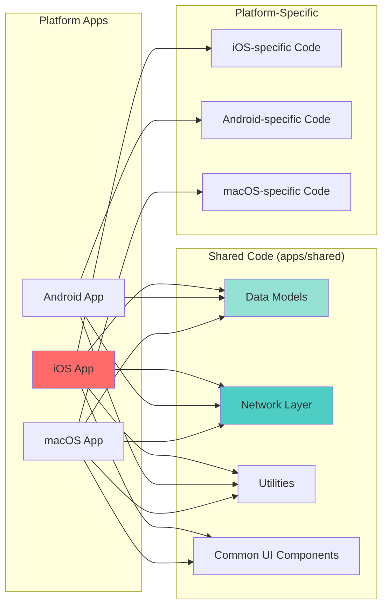
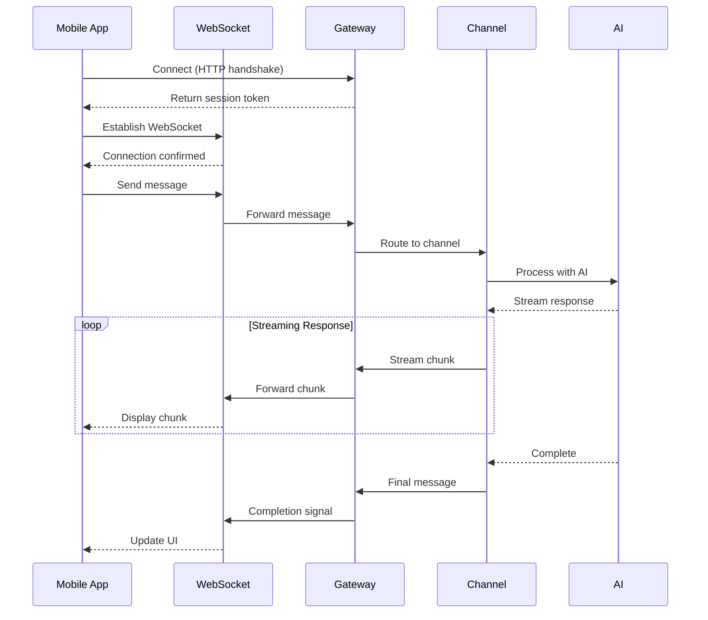
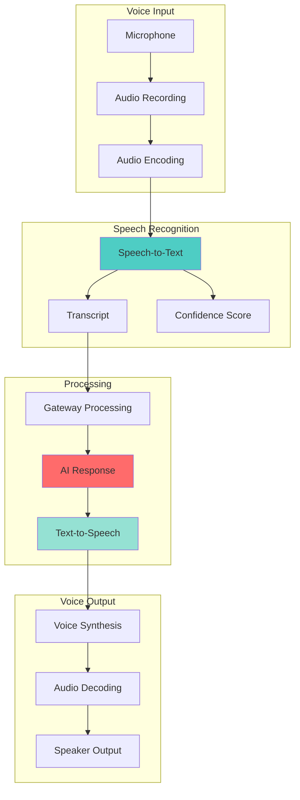
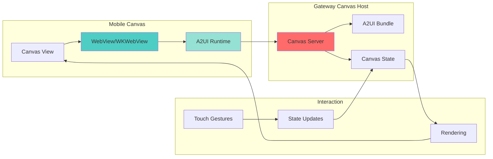
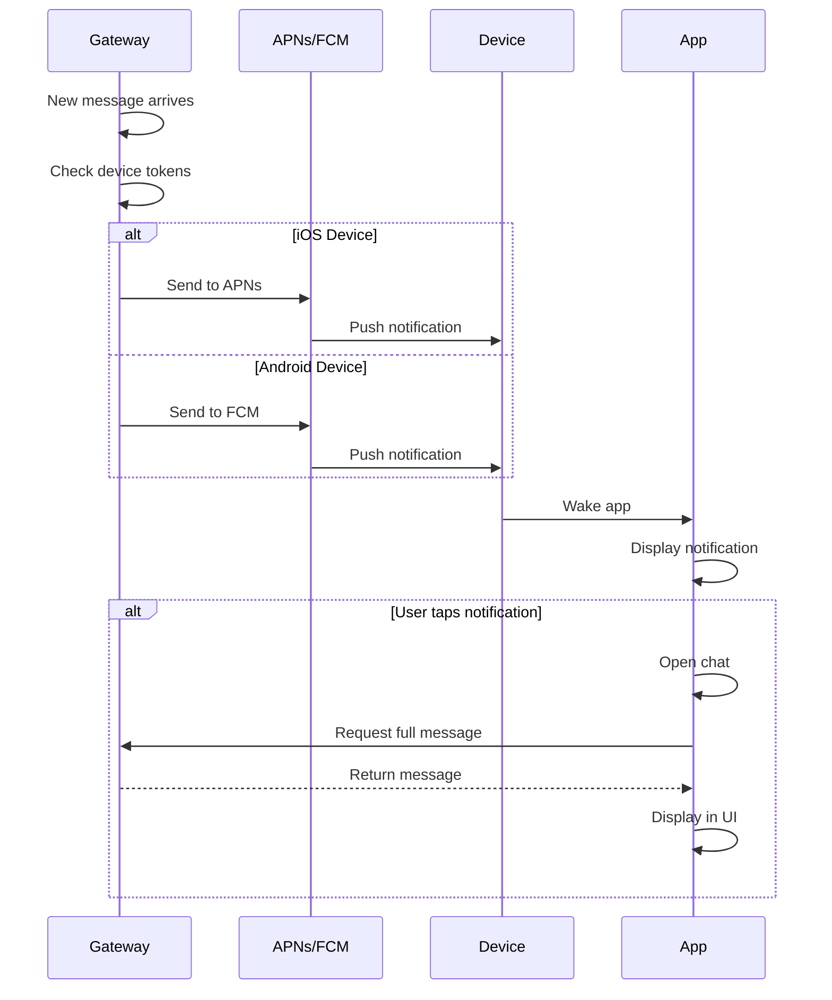
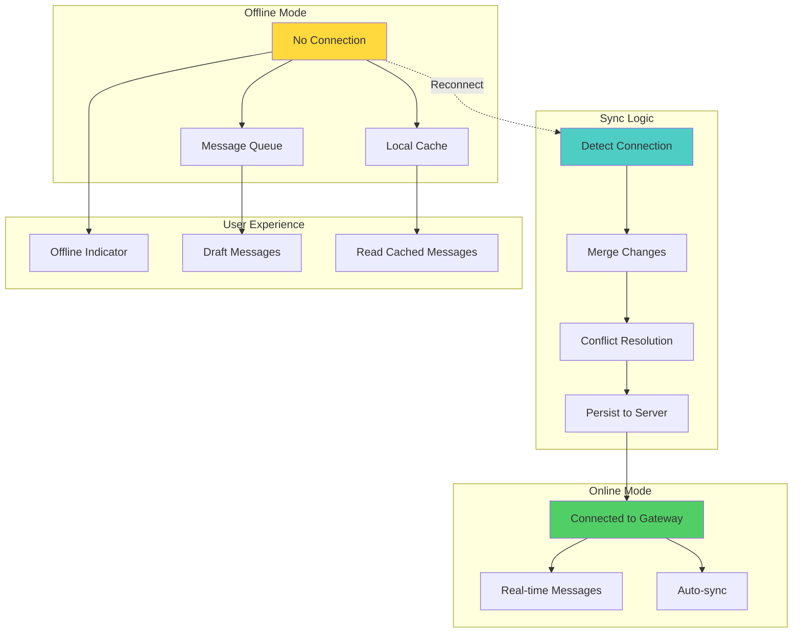

# OpenClaw Mobile Architecture

## iOS App Architecture



## Android App Architecture

```mermaid
graph TB
    subgraph "Presentation Layer (Jetpack Compose)"
        MAIN_SCREEN[MainActivity]
        CHAT_SCREEN[Chat Screen]
        SETTINGS_SCREEN[Settings Screen]
        CANVAS_SCREEN[Canvas Screen]
        VOICE_SCREEN[Voice Screen]
    end
    
    subgraph "ViewModels (AAC)"
        CHAT_VM_ANDROID[ChatViewModel]
        SETTINGS_VM_ANDROID[SettingsViewModel]
        CANVAS_VM_ANDROID[CanvasViewModel]
        VOICE_VM_ANDROID[VoiceViewModel]
    end
    
    subgraph "Domain Layer"
        USECASES[Use Cases]
        REPO[Repository]
        MODELS[Data Models]
    end
    
    subgraph "Data Layer"
        GATEWAY_API[Gateway API Client]
        WEBSOCKET_ANDROID[WebSocket Client]
        LOCAL_DB[Local Database (Room)]
        PREFS[SharedPreferences]
    end
    
    subgraph "Services"
        AUDIO_SERVICE[Audio Service]
        MEDIA_SERVICE[Media Service]
        NOTIFICATION[Notification Manager]
    end
    
    MAIN_SCREEN --> CHAT_SCREEN
    MAIN_SCREEN --> SETTINGS_SCREEN
    MAIN_SCREEN --> CANVAS_SCREEN
    MAIN_SCREEN --> VOICE_SCREEN
    
    CHAT_SCREEN --> CHAT_VM_ANDROID
    SETTINGS_SCREEN --> SETTINGS_VM_ANDROID
    CANVAS_SCREEN --> CANVAS_VM_ANDROID
    VOICE_SCREEN --> VOICE_VM_ANDROID
    
    CHAT_VM_ANDROID --> USECASES
    SETTINGS_VM_ANDROID --> USECASES
    CANVAS_VM_ANDROID --> USECASES
    VOICE_VM_ANDROID --> USECASES
    
    USECASES --> REPO
    REPO --> MODELS
    
    REPO --> GATEWAY_API
    REPO --> WEBSOCKET_ANDROID
    REPO --> LOCAL_DB
    REPO --> PREFS
    
    GATEWAY_API --> AUDIO_SERVICE
    GATEWAY_API --> MEDIA_SERVICE
    GATEWAY_API --> NOTIFICATION
    
    style MAIN_SCREEN fill:#4ecdc4
    style REPO fill:#ff6b6b
    style GATEWAY_API fill:#95e1d3
```

## macOS App Architecture



## Shared Code Architecture



## Mobile Gateway Communication



## Voice Interface Flow



## Canvas Integration



## Push Notifications



## Offline Support


