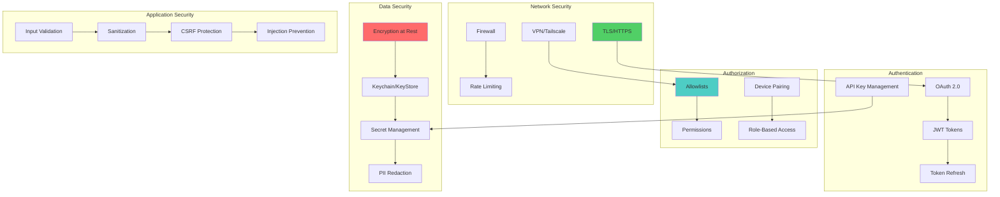
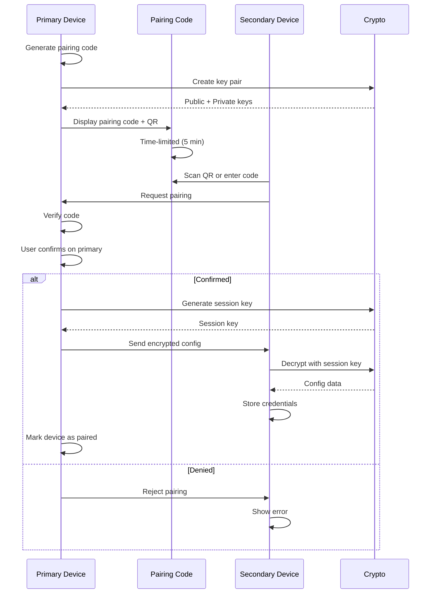
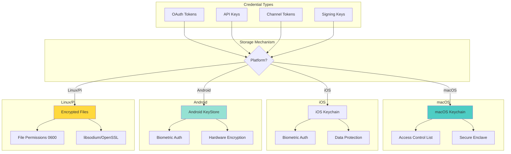
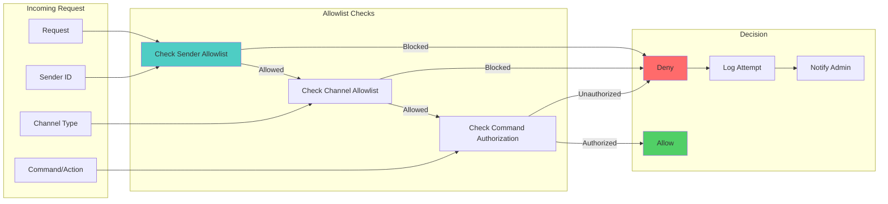
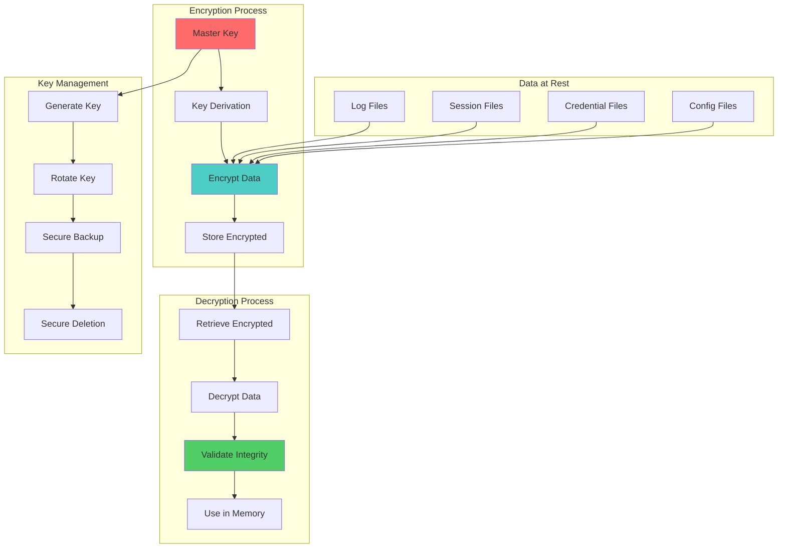
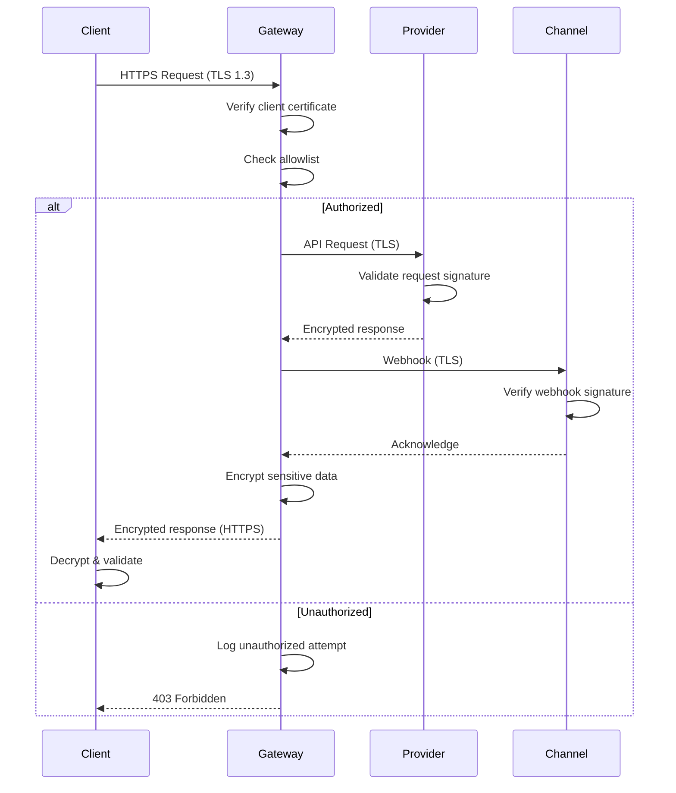
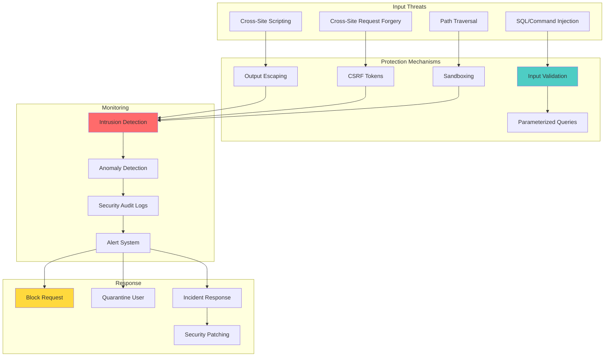
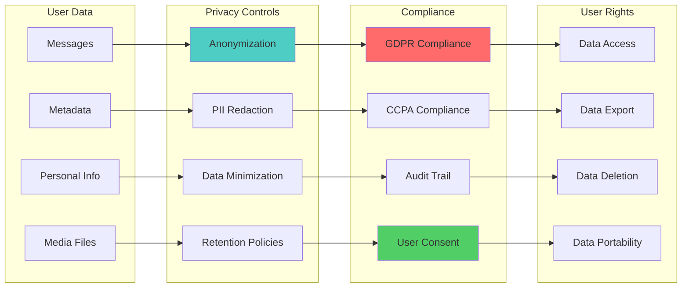
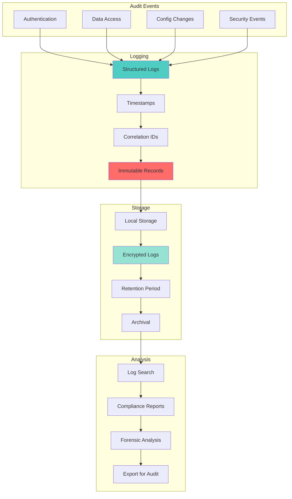

# OpenClaw Security Architecture

## Security Layers

## Device Pairing Security

## Credential Storage

## Allowlist & Authorization

## Encryption Flow

## Secure Communication

## Vulnerability Protection

## Privacy & Data Handling

## Audit & Compliance

