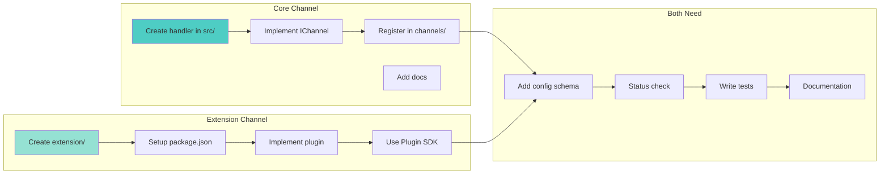
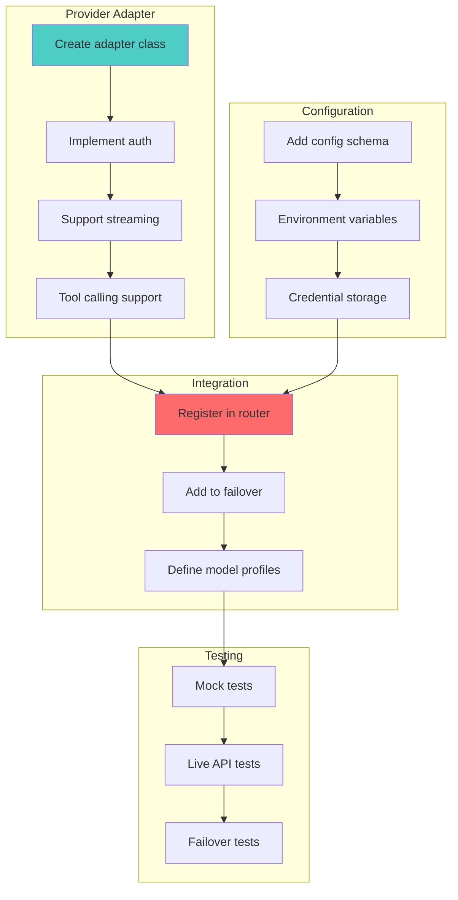
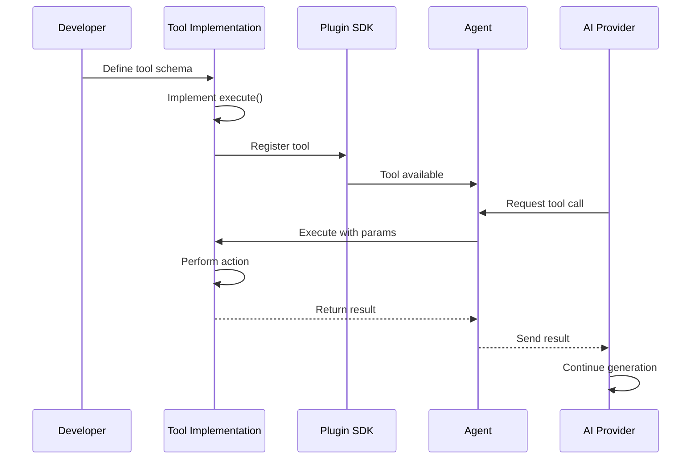
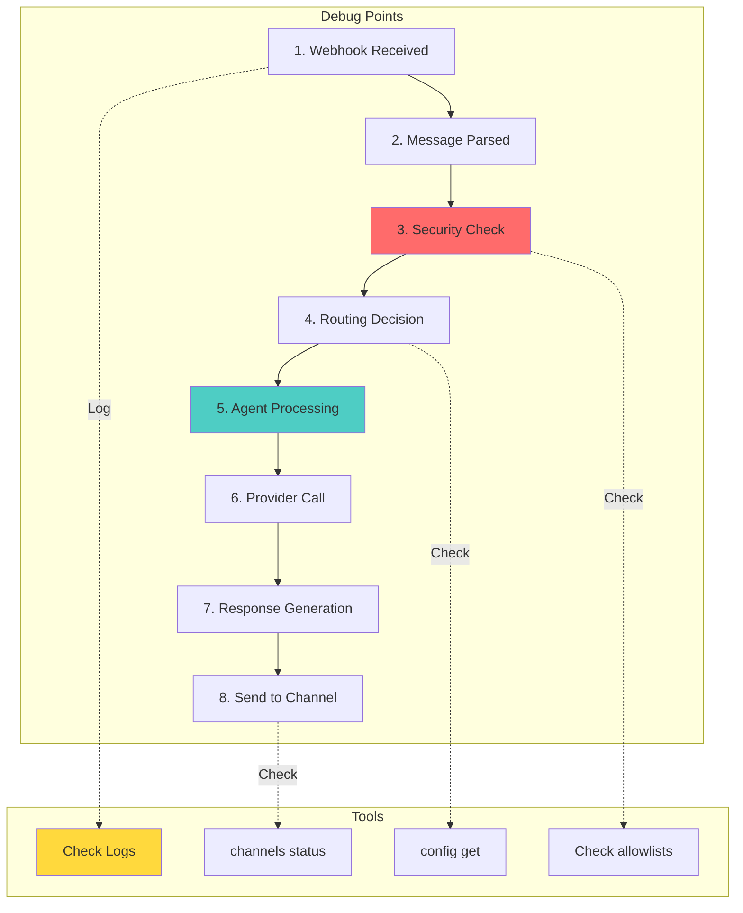
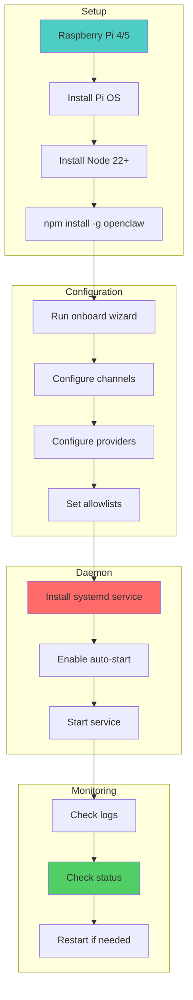
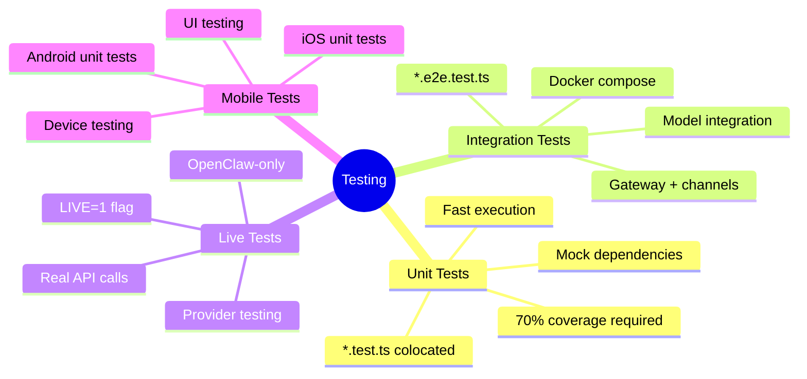
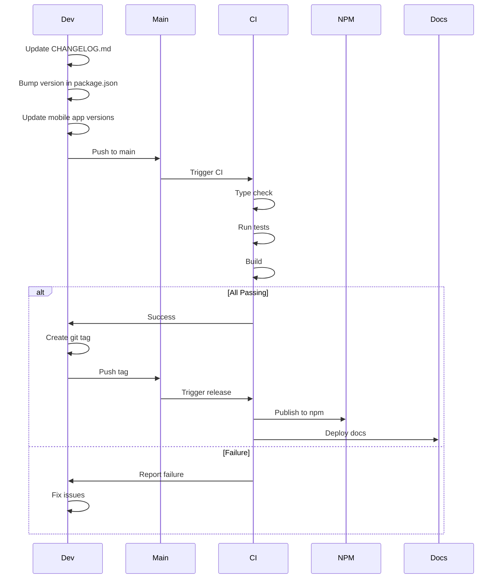

# OpenClaw Quick Reference Guide

## Common Development Tasks

### Adding a New Channel



**Steps:**
1. Decide core vs extension (use extension for external platforms)
2. Implement channel interface with send/receive methods
3. Add configuration schema and validation
4. Implement status check for connectivity
5. Write tests (unit + integration)
6. Update documentation in `docs/channels/`
7. Add to all relevant UI surfaces (app, web, CLI status)

---

### Adding a New AI Provider



**Key Files:**
- `src/providers/` - Provider adapters
- `src/providers/router.ts` - Provider routing logic
- `src/config/schema.ts` - Configuration schema

---

### Adding a New Tool for AI



**Tool Structure:**
```typescript
{
  name: "tool_name",
  description: "What the tool does",
  parameters: {
    type: "object",
    properties: {
      param1: { type: "string", description: "..." }
    },
    required: ["param1"]
  },
  execute: async (params) => {
    // Tool logic here
    return { result: "..." };
  }
}
```

**Location:**
- Core tools: `src/tools/`
- Plugin tools: `extensions/*/src/tools/`

---

### Debugging Message Flow



**Debug Commands:**
```bash
# Check channel status
openclaw channels status --deep

# Verbose gateway logs
openclaw gateway run --verbose

# macOS unified logs
./scripts/clawlog.sh --follow

# Check allowlist
openclaw config get allowlist

# Test message send
openclaw message send --to <recipient> --message "test"
```

---

### Deploying to Raspberry Pi



**Commands:**
```bash
# Install
curl -fsSL https://openclaw.ai/install.sh | bash

# Onboard
openclaw onboard --install-daemon

# Manage service
systemctl --user status openclaw-gateway
systemctl --user restart openclaw-gateway
journalctl --user -u openclaw-gateway -f

# Update
openclaw update --channel stable
```

---

### Creating a Plugin Extension

```mermaid
graph LR
    subgraph "Structure"
        CREATE_DIR[extensions/my-plugin/]
        PKG_JSON[package.json]
        SRC_DIR[src/]
        INDEX_TS[src/index.ts]
    end
    
    subgraph "Implementation"
        INTERFACE[Implement plugin interface]
        INIT[initialize function]
        HANDLERS[Handler functions]
        CONFIG[Configuration schema]
    end
    
    subgraph "Dependencies"
        DEPS[dependencies]
        DEVDEPS[devDependencies]
        PEEREPS[peerDependencies]
    end
    
    subgraph "Testing"
        TESTS[Write tests]
        CI[CI integration]
        PUBLISH[Publish (optional)]
    end
    
    CREATE_DIR --> PKG_JSON
    PKG_JSON --> SRC_DIR
    SRC_DIR --> INDEX_TS
    
    INDEX_TS --> INTERFACE
    INTERFACE --> INIT
    INIT --> HANDLERS
    HANDLERS --> CONFIG
    
    PKG_JSON --> DEPS
    PKG_JSON --> DEVDEPS
    PKG_JSON --> PEEREPS
    
    CONFIG --> TESTS
    TESTS --> CI
    CI --> PUBLISH
    
    style CREATE_DIR fill:#95e1d3
    style INTERFACE fill:#4ecdc4
```

**package.json Template:**
```json
{
  "name": "openclaw-my-plugin",
  "version": "1.0.0",
  "main": "dist/index.js",
  "dependencies": {
    "third-party": "^1.0.0"
  },
  "devDependencies": {
    "openclaw": "workspace:*"
  },
  "peerDependencies": {
    "openclaw": "*"
  }
}
```

**Plugin Template:**
```typescript
import type { Plugin } from 'openclaw/plugin-sdk';

export default {
  name: 'my-plugin',
  version: '1.0.0',
  initialize: async (sdk) => {
    // Setup code
    return {
      channels: [...],
      hooks: [...],
      tools: [...]
    };
  }
} satisfies Plugin;
```

---

### Testing Strategy



**Commands:**
```bash
# Unit tests
pnpm test

# Coverage report
pnpm test:coverage

# E2E tests
pnpm test:e2e

# Live tests (requires keys)
LIVE=1 pnpm test:live

# Watch mode
pnpm test --watch

# Specific file
pnpm test src/gateway/router.test.ts
```

---

### Release Workflow



**Release Checklist:**
1. Read `docs/reference/RELEASING.md`
2. Update CHANGELOG.md (add entry at top)
3. Bump version (package.json, mobile apps)
4. Run full gate: `pnpm build && pnpm check && pnpm test`
5. Commit: `chore: release v2026.X.Y`
6. Create tag: `git tag v2026.X.Y`
7. Push: `git push && git push --tags`
8. Publish: `npm publish` (with OTP from 1Password)
9. Build macOS app (see `docs/platforms/mac/release.md`)

---

## Common Patterns

### Accessing Configuration
```typescript
import { getConfig } from './config';

const config = await getConfig();
const apiKey = config.providers.anthropic.apiKey;
```

### Sending Messages
```typescript
import { sendMessage } from './channels';

await sendMessage({
  channel: 'telegram',
  to: 'user_id',
  message: 'Hello!'
});
```

### Calling AI
```typescript
import { callAgent } from './agents';

const response = await callAgent({
  message: 'User query',
  context: conversationHistory,
  provider: 'anthropic',
  model: 'claude-4.6-opus'
});
```

### Registering Hooks
```typescript
sdk.registerHook({
  name: 'my-hook',
  trigger: 'before-message',
  execute: async (message) => {
    // Transform message
    return modifiedMessage;
  }
});
```

### Adding Tools
```typescript
sdk.registerTool({
  name: 'my_tool',
  description: 'Does something useful',
  parameters: {
    type: 'object',
    properties: {
      input: { type: 'string' }
    }
  },
  execute: async (params) => {
    return { result: 'success' };
  }
});
```

---

## File Locations Quick Reference

### Configuration & Data
- Config: `~/.openclaw/config.json`
- Credentials: `~/.openclaw/credentials/`
- Sessions: `~/.openclaw/sessions/`
- Agent sessions: `~/.openclaw/agents/<id>/sessions/`

### Source Code
- CLI: `src/cli/`
- Commands: `src/commands/`
- Gateway: `src/gateway/`
- Channels: `src/channels/` and `src/<channel>/`
- Providers: `src/providers/`
- Agents: `src/agents/`
- Extensions: `extensions/*/`

### Applications
- macOS: `apps/macos/`
- iOS: `apps/ios/`
- Android: `apps/android/`
- Shared: `apps/shared/`

### Documentation
- User docs: `docs/`
- Diagrams: `doc_diagrams/`
- Reference: `docs/reference/`
- Release notes: `CHANGELOG.md`

### Build & Deploy
- Scripts: `scripts/`
- Docker: `Dockerfile`, `docker-compose.yml`
- CI: `.github/workflows/`
- Fly.io: `fly.toml`

---

## Troubleshooting Checklist

### Gateway Won't Start
1. Check if port is in use: `lsof -i :18789`
2. Check logs: `./scripts/clawlog.sh` (macOS) or `journalctl`
3. Verify config: `openclaw config get`
4. Check credentials: `ls ~/.openclaw/credentials/`
5. Run doctor: `openclaw doctor`

### Channel Not Responding
1. Status check: `openclaw channels status --probe`
2. Check allowlist: `openclaw config get allowlist`
3. Verify credentials for that channel
4. Check channel-specific logs
5. Test webhook/connection manually

### AI Provider Errors
1. Check credentials: `openclaw login <provider>`
2. Verify API key validity (API console)
3. Check rate limits
4. Review failover configuration
5. Try different model/provider

### Build Failures
1. Clean: `rm -rf dist node_modules`
2. Reinstall: `pnpm install`
3. Check Node version: `node --version` (need 22+)
4. Type check: `pnpm tsgo`
5. Check for syntax errors: `pnpm check`

### Test Failures
1. Run specific test: `pnpm test <file>`
2. Check for flaky tests (run multiple times)
3. Verify test dependencies (Docker, etc.)
4. Check environment variables needed
5. Review test coverage: `pnpm test:coverage`

---

## Performance Tips

### Gateway Performance
- Use Redis cache for high-traffic deployments
- Enable connection pooling for providers
- Implement rate limiting per channel
- Use streaming responses when possible

### Mobile App Performance
- Implement pagination for message lists
- Cache media locally
- Use WebSocket for real-time updates
- Enable offline support with local storage

### Plugin Performance
- Lazy load plugins on first use
- Cache expensive computations
- Use async/streaming where possible
- Monitor plugin execution time

---

For detailed architecture diagrams, see the numbered diagram files in this directory.
